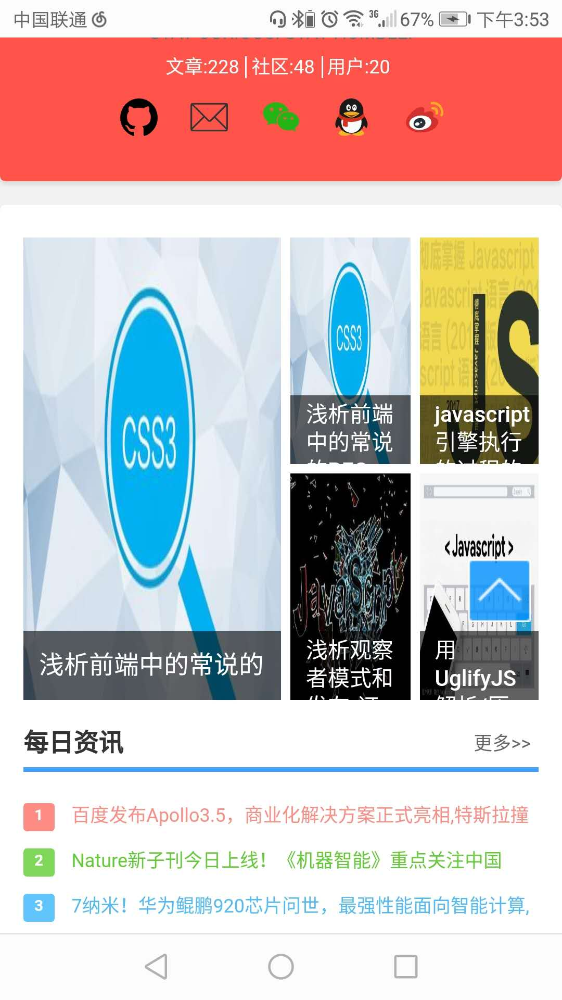

# [nodeJSBlog](https://github.com/saucxs/nodeJSBlog)
[](https://github.com/saucxs/nodeJSBlog)
[](https://github.com/saucxs/nodeJSBlog/blob/master/LICENSE)
[](https://github.com/saucxs/nodeJSBlog/stargazers)
[](https://github.com/saucxs/nodeJSBlog/network)
[](https://github.com/saucxs/nodeJSBlog/issues)

sau交流学习社区，是一个拥有博客功能，社区讨论，分享，评论等功能的一个学习分享平台，后端完全使用nodeJS，数据库使用mysql，基于nodejs的thinkjs框架搭建的，支持：1、文章评论；2、代码高亮；3、文章内容分页；4、小型bbs社区讨论社区；5、后台管理；6、权限管理等功能 。
如果喜欢`nodeJS`写的后端，支持大前端，支持全栈开发，请请`star`并`fork`项目。系统地址为：[前台系统网站](https://www.mwcxs.top)。[后台系统网站](https://www.mwcxs.top/admin)
如有使用问题请留言。

### 技术栈
> + ThinkJS（ Node端框架） [官方网站](https://thinkjs.org/)
> + jQuery.js（都懂得……）  [中文文档](http://jquery.cuishifeng.cn/)
> + Django（前端模板）  [github](https://github.com/django/django)

### 目录结构

+ app    —— node端编译后文件夹，一般情况不需要关注
+ src    —— node端服务文件夹，以业务模块划分子文件夹
    - admin  -- 管理后台
    - common  -- 通用模块，放置主配置参数、boostrap adapter middleware service 等相关组件
        - adapter  -- adapter配置   
        - bootstrap -- bootstrap框架
        - config -- 框架需要的配置以及项目自定义的配置（多模块）  
        - controller -- 控制器层
        - service -- 服务层
    - home -- 前端默认模块
    - personal --  后端管理模块
    - topic -- 话题模块     
+ view   —— 静态页面文件夹，以业务模块划分子文件夹与src对应
+ www
    - static —— 静态资源文件
        - admin —— 管理后台
        - theme  —— 主题文件
        - upload —— 上传文件
    - development.js  -- 开发环境
    - production.js   -- 生产环境    

### 一、功能特点
v1.0
1. 文章评论；
2. 代码高亮；
3. 文章内容分页；
4. 小型bbs社区讨论社区；
5. markdown文章 (上传markdown标准格式，自动解析为html文章)
6. csrf攻击 (所有请求都有csrf验证)
7. 后台管理；
8. 权限管理
9. 系统主题设置
10. 头部和底部链接配置
11. 头部滚动通告的配置
12. 注册邮件通知，登陆成功邮件通知
13. 找回密码通过注册邮箱里发密码找回链接
14. 首页接入可配置的图片轮播页
15. 百度统计代码实时配置，以及百度推送url接口的接入
16. github第三方快速登陆

v2.0

17. 节假日背景颜色的可配置模块开发
18. 注册用户邮件验证
19. 新增定时任务，推送每日最新的10篇文章
20. 社区模块没有模块和标题也能发布的问题；


### 二、版本功能
v2.0
+ 2019.01.07
    - 节假日背景颜色的可配置模块开发
    - 新增注册邮箱的验证；
    - 增定时任务：每天发定时邮件；
    - 社区模块没有模块和标题也能发布的问题；

v1.3
+ 2018.11.13
    - 忘记密码模块接入
    - 邮件模块接入
    - 增成功登陆邮件提醒；
    - 首页接入可配置的图片轮播

v1.2
+ 2018.11.11    
    - github第三方登录
    - 百.统计的实时配置
    - 百度推送url的接入到发布文章中

v1.1
+ 2018.11.09
    - 系统主题设置
    - 头部和底部链接配置
    - 头部滚动通告的配置
    
v1.0
+ 2017.03.14
    - 基本功能的完成
    - 移动端少数页面的兼容性
 

### 三、系统截图
#### 3.1 无线端

#### 3.2 PC端


### 四、运行程序请选择运行模式
可能目前fork，安装完依赖后还是不能正常显示，而是报500，那是因为数据库配置没有更改
```javascript
//压缩html,css,js 并生成相应目录
npm run compress

//运行开发模式，html,css,js均加载未压缩版本
npm run dev  

//开发模式的浏览器，浏览器访问
http://127.0.0.1:8361/

//运行生产模式，html,css,js均加载压缩版本
npm run app  

//首次运行/更新运行前请先编译项目
npm run compile

//线上推荐用pm2来运行(先配置好pm2.json)
pm2 start pm2.json

//注：线上部署，如果你使用的是win服务器，可以给我留言
```
### 五、兼容性
1. Chrome
2. Firefox
3. QQ浏览器
4. 无线端（移动端）
等
